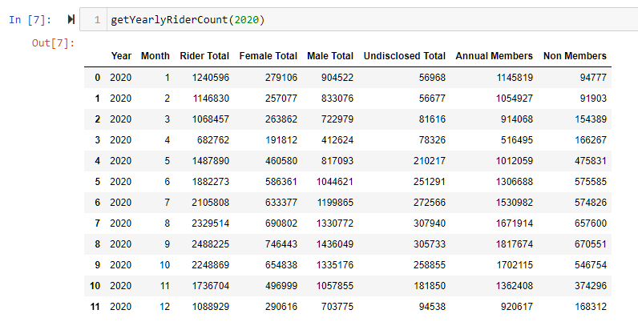
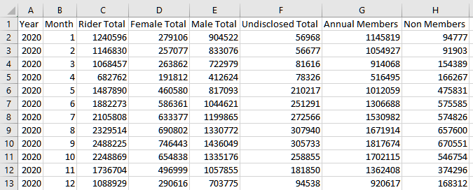
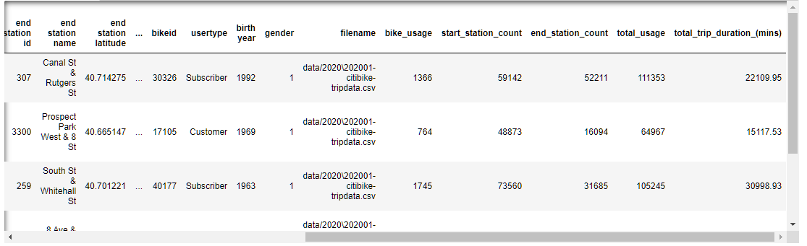

# CitiBike Usage Trends

# Prompt
Using open data from Citi Bike ([Data Source](https://www.citibikenyc.com/system-data)) I wanted to explore any trends from that past few years. I was primarily insteresed in who was using the system, where they were going, and when they were going.

# Dependencies
- Tableau
- Jupyter Notebook
- Pandas
- Datetime
- Numpy
- Glob

# Process
1. Data Aquisiton and Processing

    The three things I was interested in examining were:
    - Ridership Trends over Time
    - Usage in 2020
    - Top Stations Used

    Each time a bike is rented it gets logged in citi bike database. On an approximate monthly cycle this data is published. To get a useable sample size I looked at the past four years. The data is held in a AWS S3 bucket so downloading it is easy enough. To make the data less resource hunger that monthly CSVs are combinted and the stats of interest are aggregated. 

    Since the files all follow the same naming convention glob can be used to combine then in the jupyter notebook. To ensure all the months get combined in the correct order the `glob()` function is passed through the `sorted()` function. 
    ```
    combined_csv = sorted(glob(f'data/{year}/*-citibike-tripdata.csv'))
    ```

    Once all the months are combined they get converted to a dataframe so that comlumns can be added or formatted as necessary. For this project I'll need columns such as the year, month, day, and gender. 

    To get a finalized dataframe to convert into a CSV a few other custom functions are needed. `countRiders(month, dataframe)` will use the numerical value associated with each month (i.e. January = 1) and the the dataframe for that year to count the riders along a few categories of interest. 
    ```
    df = dataframe.loc[dataframe['month'] == str(month)]
    d['Rider Total'] = len(df)
    d['Female Total'] = len(df.loc[df['gender'] == '2'])
    d['Male Total'] = len(df.loc[df['gender'] == '1'])
    d['Undisclosed Total'] = len(df.loc[df['gender'] == '0'])
    d['Annual Members'] = len(df.loc[df['usertype'] == 'Subscriber'])
    d['Non Members'] = len(df.loc[df['usertype'] == 'Customer'])
    ```
    In the end a diction in returned for use in the `riderPerMonth()` function. Which as the name indicates will aggregate the number of riders in each of the categories.

    The `riderPerMonth()` function works by using a while loop. The i variable act as the month number and the counts from the `countRiders()` function are all apeneded to a list. Once each month is counted 1 will be added to the i variable until all 12 months have been processed.

    One final function `getYearlyRiderCount(year)` ties everything together. Year and month are inserted into the dataframe so that we can check to see if the process worked.
    ```
    def getYearlyRiderCount(year):
        df = pd.DataFrame(ridersPerMonth(bikeDataToDF(f'{year}')))
        df.insert(0, 'Year', f'{year}')
        df.insert(1, 'Month', range(1, 1 + len(df)))
    
        return df
    ```
    
 
    The `to_csv()` function from pandas will allows convert the data frame into a file that can be used in Tableau.
    

    Data Processing Summary for Ridership Over Time
      * Combine all the CSVs in a given year using `glob()`
      * Create a preliminary dataframe with rider counts for each month and time keeping columns
      * Create a final dataframe that get converted to a CSV for Tableau

    To get a more micro look a rider trends I took all the data for 2020 and preformed some further data engineering. Additional items is was interested in for 2020 was the most used stations and most used bikes by trip duration. Groupby was essential for both these categories. For the stations is allowed me to take all the trips that started and ended as a particular station and add that number to the dataframe as a column.
    ```
    start = data_2020.groupby('start station id')['start station id'].transform('count')
    stop = data_2020.groupby('end station id')['end station id'].transform('count')
    data_2020['total_usage'] = start + stop
    ```
    
    
    
    To avoid bogging down Tableau with a large file import, only the top 1000 most used bikes were used in the sample. The full set has 24,982 unique bike ids. The filtered CSV is around 89% smaller then the full dataset.
    
2. Tableau Charts

    Vist following link to see the finilized charts [Citibike Charts](https://public.tableau.com/profile/nick.voravong#!/vizhome/CitiBike2017-2020/CitiBikeTrends)

3. Trend & Observations

    * Annual subscriber count was adding over a million users per year from 2017 - 2019. Most likely due to the pandemic the subscriber count dropped by over 2.8 million members. However, a 58% increase in non-subscribers helped the total ridership drop only by around 1 million. 
    * Peak usage for bikes occurs around August and September before drastically dropping off during the winter month. Typically December and January have the lowest totals for the year. This could be a good time for station and bike maintenance.
    * If there have been any efforts to increase female ridership they have been paying off. There has been a steady increase in the percentage of female riders. The highest share of female ridership (30%) occurred in June 2020. Five points higher than any previous record high in 2019 of 25%. The month to month percetange of female riders for 2020 was also higher than that record high from 2019.
    * There isn’t a strong correlation between how often a bike is rented vs how long it’s on the road.
    * The most used stations were typically near greenspaces with 10 of the top fifty most used stations around Central Park.

    
    
